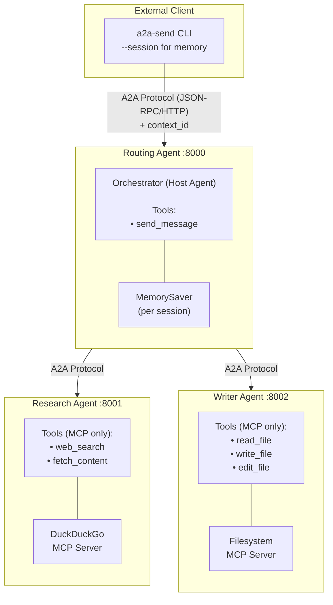
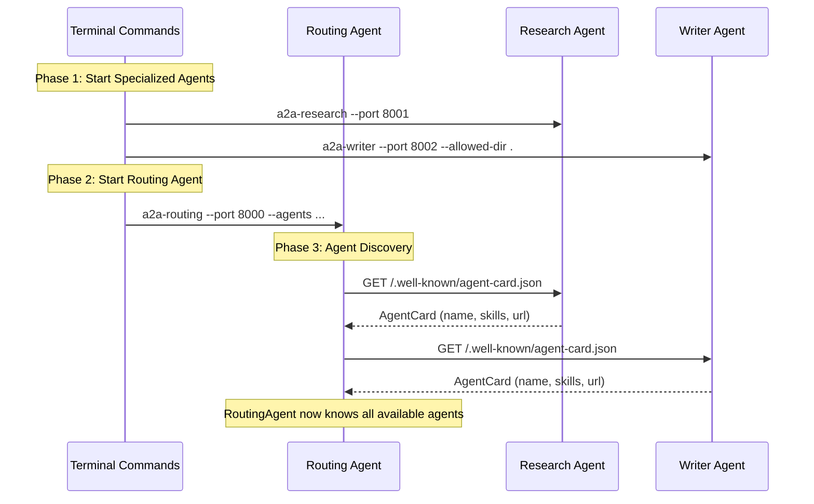
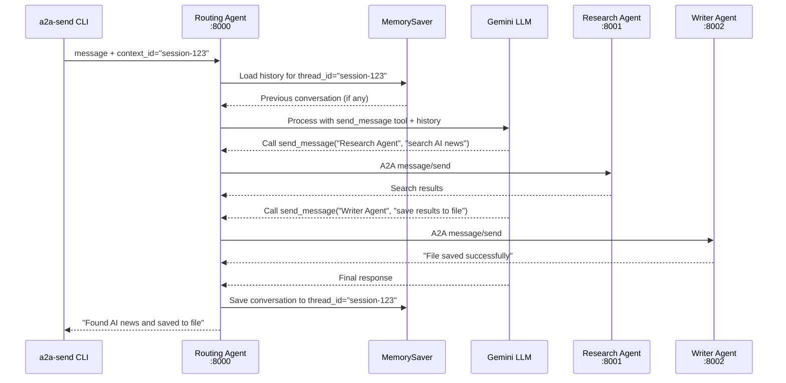
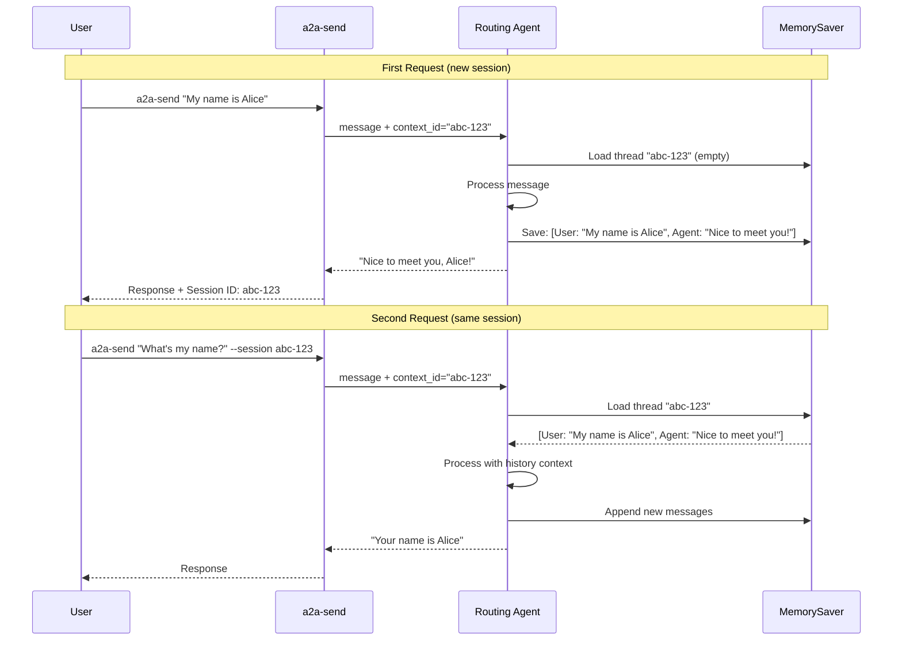

# A2A Protocol Demo - Agent to Agent Communication

A production-grade demonstration of Google's [Agent-to-Agent (A2A) protocol](https://github.com/a2aproject/a2a-samples) implementing the **Host Agent Pattern** — a central orchestrator delegates tasks to specialized agents.

## Architecture



### Key Design Principles

1. **RoutingAgent is the only entry point** — Clients send all requests to port 8000
2. **Specialized agents have NO delegation tools** — They only have their MCP tools
3. **Agent discovery uses A2A protocol** — `/.well-known/agent-card.json` endpoints
4. **Communication uses official SDK** — `A2ACardResolver` and `A2AClient`

## Setup

```bash
cd a2a-demo

# Create virtual environment  
python -m venv .venv
source .venv/bin/activate  # Windows: .venv\Scripts\activate

# Install dependencies
pip install -e .

# Configure API key
echo "GOOGLE_API_KEY=your-key-here" > .env
```

## Quick Start

### Start the Agents (3 separate terminals)

**Terminal 1 - Research Agent:**
```bash
a2a-research --port 8001
```

**Terminal 2 - Writer Agent:**
```bash
a2a-writer --port 8002 --allowed-dir .
```

**Terminal 3 - Routing Agent (start after the others are running):**
```bash
a2a-routing --port 8000 --agents http://localhost:8001 http://localhost:8002
```

### Send a Request

```bash
a2a-send "Search for Python 3.13 features and save a summary to python_features.txt" --url http://localhost:8000
```

Or use curl directly:
```bash
curl -X POST http://localhost:8000/ \
  -H "Content-Type: application/json" \
  -d '{
    "jsonrpc": "2.0",
    "method": "message/send",
    "id": "1",
    "params": {
      "message": {
        "messageId": "msg-001",
        "role": "user",
        "parts": [{"kind": "text", "text": "Search for Python 3.13 features and save a summary to python_features.txt"}]
      }
    }
  }'
```

### 3. Check Results

```bash
cat python_features.txt
```

## How It Works

### Request Flow

```
User Request → RoutingAgent → Analyzes task
                    │
                    ├─→ "Need web search" → Research Agent → Results
                    │
                    └─→ "Need file write" → Writer Agent → Success
                    │
                    └─→ Response to user
```

### Example: "Search for X and save to file"

1. **User** sends request to RoutingAgent (port 8000)
2. **RoutingAgent** analyzes: needs search AND file write
3. **RoutingAgent** calls `send_message("Research Agent", "search for X")`
4. **Research Agent** executes web search, returns results
5. **RoutingAgent** calls `send_message("Writer Agent", "save this to file")`
6. **Writer Agent** writes file, returns confirmation
7. **RoutingAgent** compiles final response to user

## API Reference

### Send Message to Routing Agent

**Endpoint:** `POST http://localhost:8000/`

```json
{
  "jsonrpc": "2.0",
  "method": "message/send",
  "id": "unique-request-id",
  "params": {
    "message": {
      "messageId": "unique-message-id",
      "role": "user",
      "parts": [{"kind": "text", "text": "Your task here"}]
    }
  }
}
```

**Response:**
```json
{
  "jsonrpc": "2.0",
  "id": "unique-request-id",
  "result": {
    "kind": "task",
    "id": "task-uuid",
    "status": {
      "state": "completed",
      "message": {
        "parts": [{"kind": "text", "text": "Agent response here"}]
      }
    }
  }
}
```

### Get Agent Card (Discovery)

```bash
# Routing Agent
curl http://localhost:8000/.well-known/agent-card.json

# Research Agent  
curl http://localhost:8001/.well-known/agent-card.json

# Writer Agent
curl http://localhost:8002/.well-known/agent-card.json
```

## Example Tasks

### Multi-Agent Tasks (via Routing Agent)

```bash
# Search and save to file
a2a-send "Search for latest AI news and save a summary to ai_news.txt" --url http://localhost:8000

# Research and document
a2a-send "Find Docker best practices and write them to docker_tips.txt" --url http://localhost:8000

# Complex task with multiple agents
a2a-send "Search for Python asyncio tutorials, summarize the key points, and save to asyncio_guide.txt" --url http://localhost:8000
```

### Direct Agent Access (for testing only)

You can access specialized agents directly, but they won't delegate:

```bash
# Research Agent directly (web search only)
a2a-send "Search for Rust programming tips" --url http://localhost:8001

# Writer Agent directly (file operations only)
a2a-send "Write 'Hello World' to hello.txt" --url http://localhost:8002
```

**Note:** Direct access bypasses orchestration — always use the Routing Agent for real tasks.

## CLI Reference

### a2a-send - Interactive Client

The `a2a-send` command supports multiple modes for interacting with agents:

```bash
# Single message (auto-generates session ID)
a2a-send "Search for Python 3.13 features" --url http://localhost:8000

# Interactive chat mode (no message = enters interactive mode)
a2a-send --url http://localhost:8000

# Explicit interactive mode
a2a-send -i --url http://localhost:8000

# Continue a previous conversation (session continuity)
a2a-send "What did you find?" --session abc-123 --url http://localhost:8000
```

**Options:**

| Option | Description |
|--------|-------------|
| `message` | Message to send (optional - prompts if not provided) |
| `--url` | Agent URL (default: `http://localhost:8000`) |
| `--session` | Session ID for conversation continuity |
| `-i, --interactive` | Force interactive chat mode |

**Session Continuity:**

The agent remembers context within a session. Use `--session` to continue conversations:

```bash
# First message - note the session ID in output
$ a2a-send "My name is Alice" --url http://localhost:8000
Response: Nice to meet you, Alice!
(Session ID: abc-123 - use --session abc-123 to continue this conversation)

# Continue the conversation
$ a2a-send "What's my name?" --session abc-123 --url http://localhost:8000
Response: Your name is Alice, as you told me earlier.
```

**Interactive Mode:**

When no message is provided, or with `-i`, the CLI enters interactive chat mode:

```
$ a2a-send --url http://localhost:8000

Connecting to http://localhost:8000...
Connected to: Routing Agent
Session ID: def-456
Type 'exit' or 'quit' to end the session.

You: Search for Rust features
Agent: I found information about Rust...

You: Save that to rust_features.txt
Agent: Done! I've saved the Rust features to rust_features.txt.

You: exit
Goodbye!
```

### Agent Commands

```bash
# Research Agent
a2a-research --host localhost --port 8001 --mcp-command "uvx ddgs-mcp"

# Writer Agent
a2a-writer --host localhost --port 8002 --allowed-dir . --mcp-command "npx -y @modelcontextprotocol/server-filesystem"

# Routing Agent (discovers other agents)
a2a-routing --host localhost --port 8000 --agents http://localhost:8001 http://localhost:8002
```

## Project Structure

```
a2a-demo/
├── pyproject.toml              # Dependencies
├── .env                        # GOOGLE_API_KEY
├── tmux-start.sh               # Tmux session launcher
├── .tmux.conf                  # Tmux configuration (optional)
└── a2a_demo/
    ├── __init__.py
    ├── cli/                    # CLI entry points
    │   ├── research.py         # a2a-research command
    │   ├── writer.py           # a2a-writer command
    │   ├── routing.py          # a2a-routing command
    │   └── send.py             # a2a-send command
    ├── core/
    │   └── registry.py         # A2ACardResolver + A2AClient wrapper
    ├── mcp/
    │   └── manager.py          # Persistent MCP connections
    └── agents/
        ├── __init__.py
        ├── base.py             # BaseAgent (MCP tools only, no delegation)
        ├── routing.py          # RoutingAgent (orchestrator with send_message)
        ├── research.py         # ResearchAgent (DuckDuckGo MCP)
        └── writer.py           # WriterAgent (Filesystem MCP)
```

## Technical Details

### Agent Discovery (A2A Protocol)

The RoutingAgent discovers specialized agents using the official `A2ACardResolver`:

```python
from a2a.client import A2ACardResolver

resolver = A2ACardResolver()
card = await resolver.get_agent_card("http://localhost:8001")
# Returns: AgentCard with name, description, skills, url
```

### Inter-Agent Communication

The RoutingAgent communicates with specialized agents using `A2AClient`:

```python
from a2a.client import A2AClient

client = A2AClient(httpx.AsyncClient(), agent_card)
response = await client.send_message(
    message=Message(
        messageId="msg-001",
        role="user",
        parts=[Part(kind="text", text="Your task")]
    )
)
```

### RoutingAgent's send_message Tool

The RoutingAgent has a single tool for delegation:

```python
@tool
async def send_message(agent_name: str, task: str) -> str:
    """Send a task to another agent via A2A protocol.
    
    Args:
        agent_name: Name of the agent (e.g., "Research Agent", "Writer Agent")
        task: The task description to send
    
    Returns:
        The agent's response
    """
```

### Conversation Memory

Agents maintain conversation context using LangGraph's `MemorySaver` with A2A's `context_id`:

```python
from a2a.types import Message

message = Message(
    message_id="unique-id",
    role=Role.user,
    parts=[Part(root=TextPart(text="Your message"))],
    context_id="session-123",  # Links messages in same conversation
)
```

**How it works:**

1. Client sends message with `context_id` (session ID)
2. A2A server passes `context_id` to the agent's `process()` method
3. Agent uses `context_id` as LangGraph's `thread_id` for memory lookup
4. `MemorySaver` retrieves/stores conversation history per thread

```
Session "abc-123":
  User: "My name is Alice"
  Agent: "Nice to meet you!"
  User: "What's my name?"
  Agent: "Your name is Alice"  ← Remembers from same session

Session "def-456":
  User: "What's my name?"
  Agent: "I don't know your name"  ← Different session, no memory
```

## Sequence Diagrams

### Startup Sequence



### Multi-Agent Task Flow



### Session Memory Flow



## License

MIT
