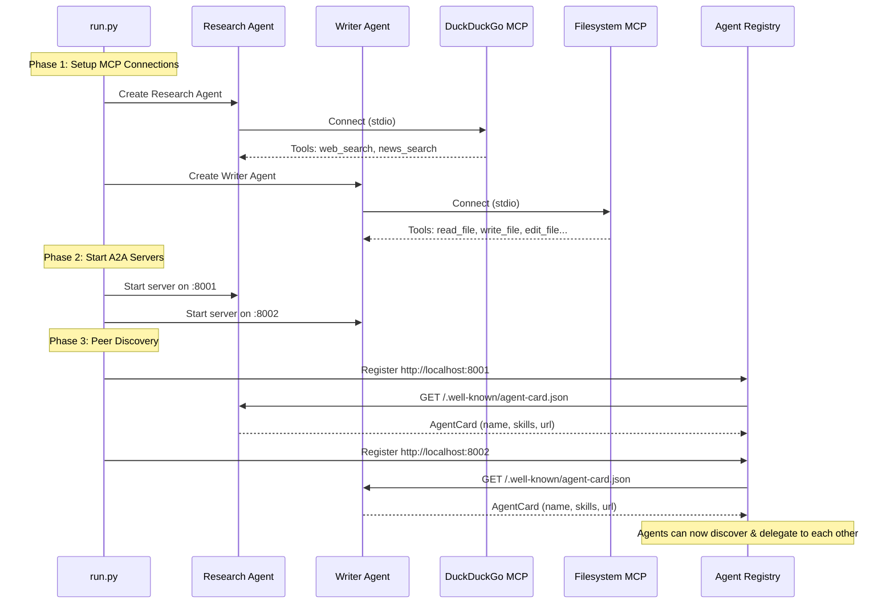
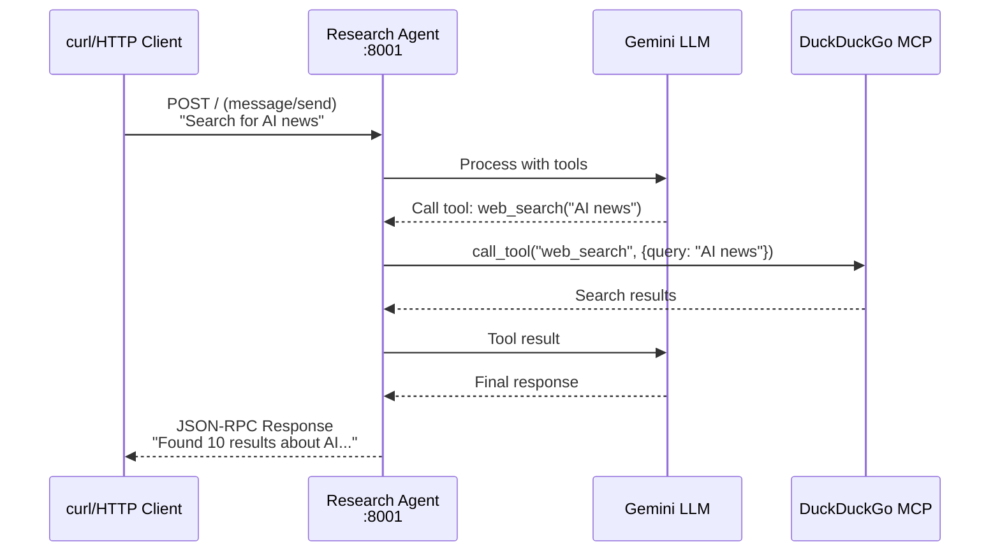
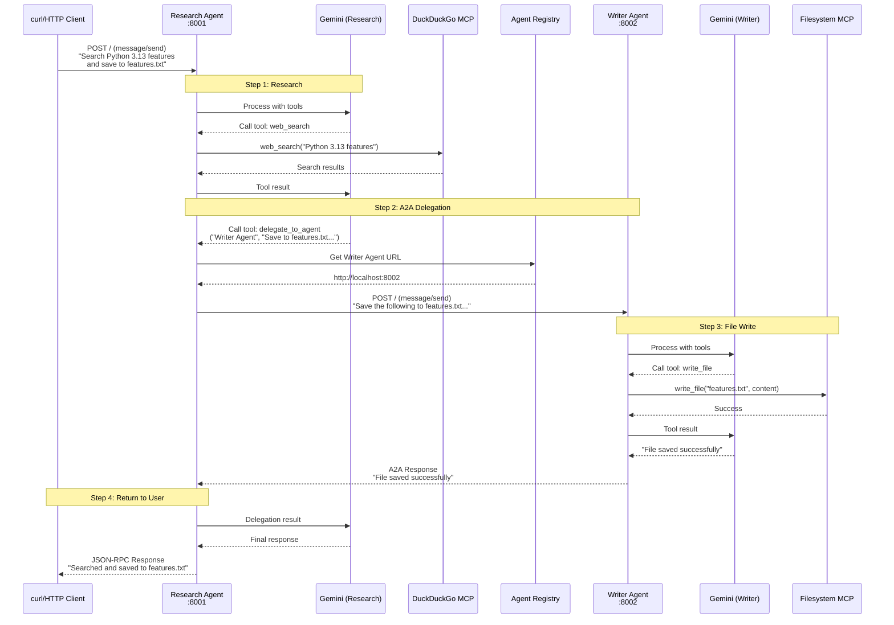
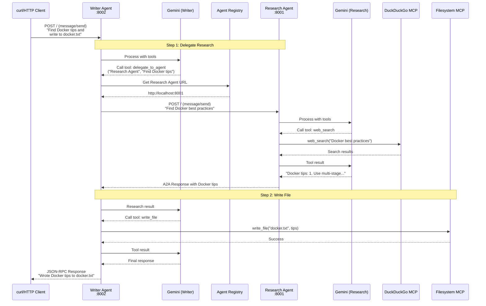
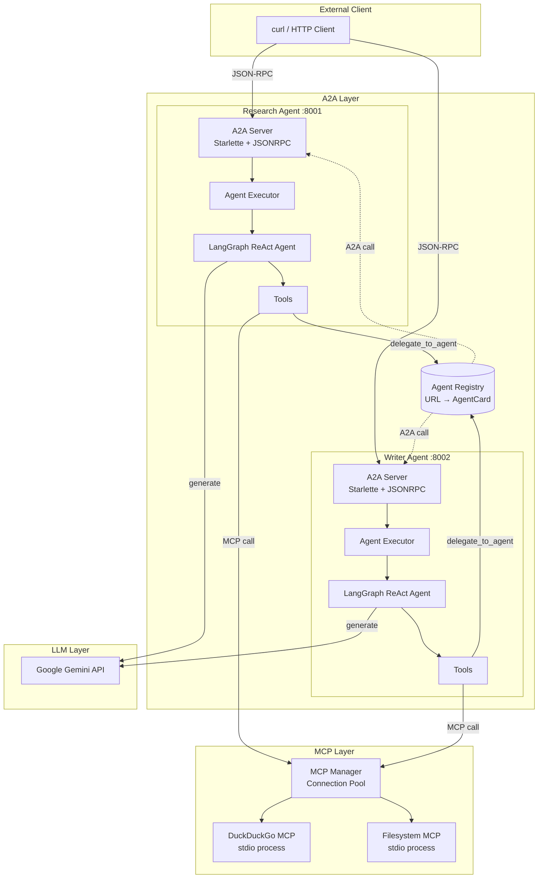
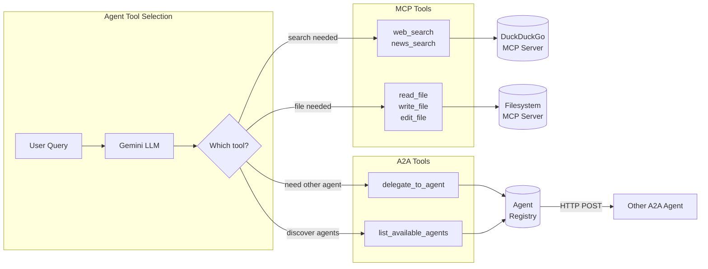

# A2A Protocol Demo - Agent to Agent Communication

A demonstration of Google's Agent-to-Agent (A2A) protocol with true inter-agent delegation:
- **Research Agent** (DuckDuckGo MCP) can delegate file operations to Writer Agent
- **Writer Agent** (Filesystem MCP) can delegate research to Research Agent
- Both communicate via A2A protocol (JSON-RPC over HTTP)

## Architecture

```
┌─────────────────────────────────────────────────────────────────────┐
│                        External Client                              │
│              (curl, httpie, or any HTTP client)                     │
└─────────────────────────┬───────────────────────────────────────────┘
                          │ A2A Protocol (JSON-RPC/HTTP)
          ┌───────────────┴───────────────┐
          ▼                               ▼
┌─────────────────────────┐     ┌─────────────────────────┐
│   Research Agent        │◄───►│   Writer Agent          │
│   Port: 8001            │ A2A │   Port: 8002            │
│                         │     │                         │
│   Tools:                │     │   Tools:                │
│   - web_search          │     │   - read_file           │
│   - delegate_to_agent   │     │   - write_file          │
│   - list_agents         │     │   - edit_file           │
│                         │     │   - delegate_to_agent   │
│   ┌───────────────┐     │     │   ┌───────────────┐     │
│   │ DuckDuckGo    │     │     │   │ Filesystem    │     │
│   │ MCP Server    │     │     │   │ MCP Server    │     │
│   └───────────────┘     │     │   └───────────────┘     │
└─────────────────────────┘     └─────────────────────────┘
```

## Setup

```bash
cd a2a-demo

# Create virtual environment  
python -m venv .venv
source .venv/bin/activate  # Windows: .venv\Scripts\activate

# Install dependencies
pip install -e .

# Configure API key
echo "GOOGLE_API_KEY=your-key-here" > .env
```

## Quick Start

### 1. Start the Servers

```bash
python run.py run --output-dir ./output
```

This starts:
- **Research Agent** on `http://localhost:8001`
- **Writer Agent** on `http://localhost:8002`
- Output directory at `./output` for file operations

### 2. Send a Request

In another terminal, send a task using curl:

```bash
# Search and save to file (demonstrates A2A delegation)
curl -X POST http://localhost:8001/ \
  -H "Content-Type: application/json" \
  -d '{
    "jsonrpc": "2.0",
    "method": "message/send",
    "id": "1",
    "params": {
      "message": {
        "messageId": "msg-001",
        "role": "user",
        "parts": [{"kind": "text", "text": "Search for Python 3.13 features and save a summary to python_features.txt"}]
      }
    }
  }'
```

### 3. Check Results

```bash
cat ./output/python_features.txt
```

## API Reference

### Send Message to Agent

**Endpoint:** `POST http://localhost:{port}/`

**Request:**
```json
{
  "jsonrpc": "2.0",
  "method": "message/send",
  "id": "unique-request-id",
  "params": {
    "message": {
      "messageId": "unique-message-id",
      "role": "user",
      "parts": [{"kind": "text", "text": "Your task here"}]
    }
  }
}
```

**Response:**
```json
{
  "jsonrpc": "2.0",
  "id": "unique-request-id",
  "result": {
    "kind": "task",
    "id": "task-uuid",
    "status": {
      "state": "completed",
      "message": {
        "parts": [{"kind": "text", "text": "Agent response here"}]
      }
    }
  }
}
```

### Get Agent Card (Discovery)

```bash
# Agent metadata and capabilities
curl http://localhost:8001/.well-known/agent-card.json
```

## Example Tasks

### Research Agent (port 8001)
```bash
# Simple search
curl -X POST http://localhost:8001/ \
  -H "Content-Type: application/json" \
  -d '{
    "jsonrpc": "2.0", "method": "message/send", "id": "1",
    "params": {"message": {"messageId": "m1", "role": "user", 
      "parts": [{"kind": "text", "text": "Search for latest AI news"}]}}
  }'

# Search + delegate file save to Writer Agent
curl -X POST http://localhost:8001/ \
  -H "Content-Type: application/json" \
  -d '{
    "jsonrpc": "2.0", "method": "message/send", "id": "2",
    "params": {"message": {"messageId": "m2", "role": "user", 
      "parts": [{"kind": "text", "text": "Search for Rust programming tips and save them to rust_tips.txt"}]}}
  }'
```

### Writer Agent (port 8002)
```bash
# Write a file
curl -X POST http://localhost:8002/ \
  -H "Content-Type: application/json" \
  -d '{
    "jsonrpc": "2.0", "method": "message/send", "id": "1",
    "params": {"message": {"messageId": "m1", "role": "user", 
      "parts": [{"kind": "text", "text": "Write hello world to hello.txt"}]}}
  }'

# Read a file
curl -X POST http://localhost:8002/ \
  -H "Content-Type: application/json" \
  -d '{
    "jsonrpc": "2.0", "method": "message/send", "id": "2",
    "params": {"message": {"messageId": "m2", "role": "user", 
      "parts": [{"kind": "text", "text": "Read the contents of hello.txt"}]}}
  }'

# Research + write (delegates to Research Agent)
curl -X POST http://localhost:8002/ \
  -H "Content-Type: application/json" \
  -d '{
    "jsonrpc": "2.0", "method": "message/send", "id": "3",
    "params": {"message": {"messageId": "m3", "role": "user", 
      "parts": [{"kind": "text", "text": "Find information about Docker best practices and write it to docker_tips.txt"}]}}
  }'
```

## CLI Options

```bash
# Run with custom ports
python run.py run \
  --host 0.0.0.0 \
  --research-port 9001 \
  --writer-port 9002 \
  --output-dir /tmp/a2a-output

# Use custom MCP servers
python run.py run \
  --research-mcp "uvx ddgs-mcp" \
  --writer-mcp "npx -y @modelcontextprotocol/server-filesystem /custom/path"
```

## Project Structure

```
a2a-demo/
├── run.py                  # Main entry point
├── pyproject.toml          # Dependencies
├── .env                    # GOOGLE_API_KEY
├── output/                 # Writer Agent file operations
└── a2a_demo/
    ├── __init__.py
    ├── core/
    │   └── registry.py     # A2A agent discovery & routing
    ├── mcp/
    │   └── manager.py      # Persistent MCP connections
    └── agents/
        ├── base.py         # Base agent with delegation tools
        ├── research.py     # Research Agent (DuckDuckGo)
        └── writer.py       # Writer Agent (Filesystem)
```

## How It Works Under the Hood

### Startup Sequence



### Simple Request Flow (No Delegation)



### A2A Delegation Flow (Research → Writer)



### Bidirectional Delegation (Writer → Research)



### Component Architecture



### Tool Resolution Flow



### Data Flow Summary

| Step | Component | Protocol | Description |
|------|-----------|----------|-------------|
| 1 | Client → Agent | HTTP/JSON-RPC | A2A `message/send` request |
| 2 | Agent → LLM | HTTPS | Gemini API call with tools |
| 3 | Agent → MCP | stdio/JSON-RPC | Tool execution (search/file) |
| 4 | Agent → Agent | HTTP/JSON-RPC | A2A delegation via Registry |
| 5 | Agent → Client | HTTP/JSON-RPC | A2A response with result |
