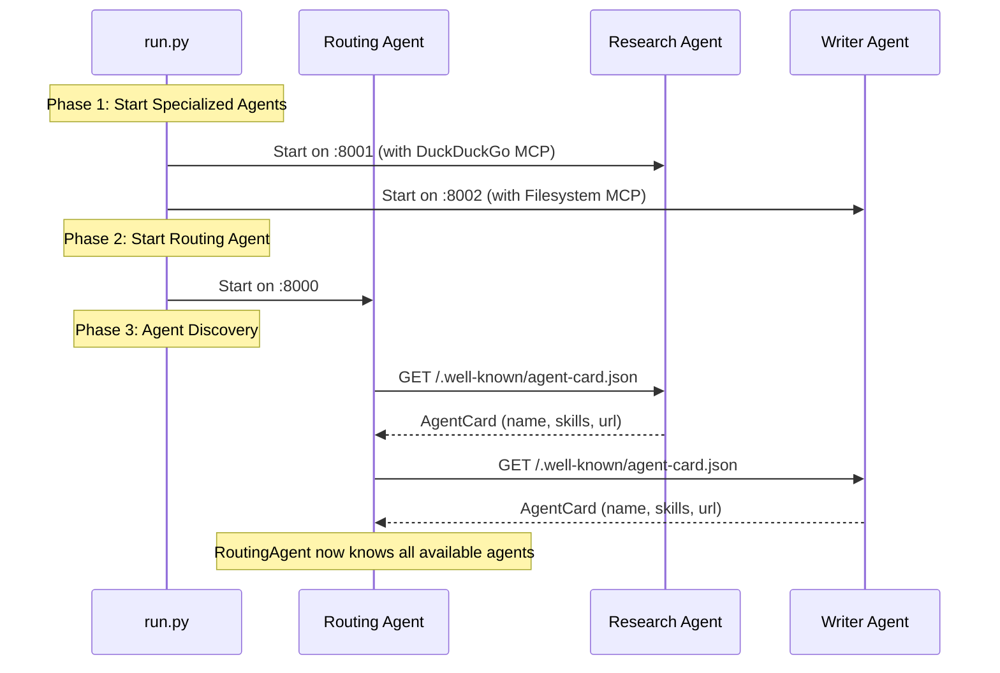
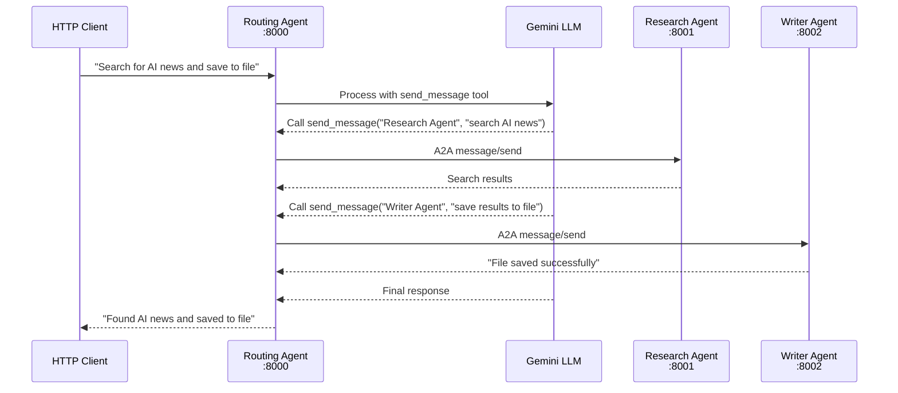

# A2A Protocol Demo - Agent to Agent Communication

A production-grade demonstration of Google's Agent-to-Agent (A2A) protocol implementing the **Host Agent Pattern** — a central orchestrator delegates tasks to specialized agents.

## What's New (v2.0)

This project was refactored to follow [Google's official A2A multi-agent patterns](https://github.com/a2aproject/a2a-samples):

| Before (v1) | After (v2) |
|-------------|------------|
| Peer-to-peer delegation | Host agent orchestration |
| Every agent had `delegate_to_agent` tool | Only RoutingAgent delegates |
| Specialized agents knew about other agents | Specialized agents are pure domain experts |
| Delegation logic in system prompts | Clean separation of concerns |

### Why the Change?

The original peer-to-peer approach had issues:
1. **Coupling**: Every agent needed to know about every other agent
2. **Confusion**: LLMs often didn't use delegation tools correctly
3. **Scaling**: Adding new agents required updating all existing agents

The **Host Agent Pattern** (used by Google's official samples) solves these:
1. **Single orchestrator** (RoutingAgent) handles all routing decisions
2. **Specialized agents** focus purely on their domain
3. **Clean interfaces** — agents communicate only through A2A protocol

## Architecture

```
┌─────────────────────────────────────────────────────────────────────────┐
│                          External Client                                 │
│                (curl, httpie, or any HTTP client)                       │
└─────────────────────────────┬───────────────────────────────────────────┘
                              │ A2A Protocol (JSON-RPC/HTTP)
                              ▼
                    ┌─────────────────────┐
                    │   Routing Agent     │ ← Orchestrator (Host Agent)
                    │   Port: 8000        │
                    │                     │
                    │   Tools:            │
                    │   - send_message    │ ← Single delegation tool
                    └──────────┬──────────┘
                               │ A2A Protocol
              ┌────────────────┴────────────────┐
              ▼                                 ▼
┌─────────────────────────┐       ┌─────────────────────────┐
│   Research Agent        │       │   Writer Agent          │
│   Port: 8001            │       │   Port: 8002            │
│                         │       │                         │
│   Tools (MCP only):     │       │   Tools (MCP only):     │
│   - web_search          │       │   - read_file           │
│   - fetch_content       │       │   - write_file          │
│                         │       │   - edit_file           │
│   ┌───────────────┐     │       │   ┌───────────────┐     │
│   │ DuckDuckGo    │     │       │   │ Filesystem    │     │
│   │ MCP Server    │     │       │   │ MCP Server    │     │
│   └───────────────┘     │       └───────────────────┘     │
└─────────────────────────┘       └─────────────────────────┘
```

### Key Design Principles

1. **RoutingAgent is the only entry point** — Clients send all requests to port 8000
2. **Specialized agents have NO delegation tools** — They only have their MCP tools
3. **Agent discovery uses A2A protocol** — `/.well-known/agent-card.json` endpoints
4. **Communication uses official SDK** — `A2ACardResolver` and `A2AClient`

## Setup

```bash
cd a2a-demo

# Create virtual environment  
python -m venv .venv
source .venv/bin/activate  # Windows: .venv\Scripts\activate

# Install dependencies
pip install -e .

# Configure API key
echo "GOOGLE_API_KEY=your-key-here" > .env
```

## Quick Start

### 1. Start All Agents

```bash
python run.py run --output-dir ./output
```

This starts:
- **Routing Agent** on `http://localhost:8000` (orchestrator - send all requests here)
- **Research Agent** on `http://localhost:8001` (web search capabilities)
- **Writer Agent** on `http://localhost:8002` (file operations)

### 2. Send a Request

All requests go to the **Routing Agent** (port 8000):

```bash
# Using the CLI helper
python run.py send "Search for Python 3.13 features and save a summary to /full/path/to/output/python_features.txt" --port 8000

# Or using curl directly
curl -X POST http://localhost:8000/ \
  -H "Content-Type: application/json" \
  -d '{
    "jsonrpc": "2.0",
    "method": "message/send",
    "id": "1",
    "params": {
      "message": {
        "messageId": "msg-001",
        "role": "user",
        "parts": [{"kind": "text", "text": "Search for Python 3.13 features and save a summary to python_features.txt"}]
      }
    }
  }'
```

### 3. Check Results

```bash
cat ./output/python_features.txt
```

## How It Works

### Request Flow

```
User Request → RoutingAgent → Analyzes task
                    │
                    ├─→ "Need web search" → Research Agent → Results
                    │
                    └─→ "Need file write" → Writer Agent → Success
                    │
                    └─→ Response to user
```

### Example: "Search for X and save to file"

1. **User** sends request to RoutingAgent (port 8000)
2. **RoutingAgent** analyzes: needs search AND file write
3. **RoutingAgent** calls `send_message("Research Agent", "search for X")`
4. **Research Agent** executes web search, returns results
5. **RoutingAgent** calls `send_message("Writer Agent", "save this to file")`
6. **Writer Agent** writes file, returns confirmation
7. **RoutingAgent** compiles final response to user

## API Reference

### Send Message to Routing Agent

**Endpoint:** `POST http://localhost:8000/`

```json
{
  "jsonrpc": "2.0",
  "method": "message/send",
  "id": "unique-request-id",
  "params": {
    "message": {
      "messageId": "unique-message-id",
      "role": "user",
      "parts": [{"kind": "text", "text": "Your task here"}]
    }
  }
}
```

**Response:**
```json
{
  "jsonrpc": "2.0",
  "id": "unique-request-id",
  "result": {
    "kind": "task",
    "id": "task-uuid",
    "status": {
      "state": "completed",
      "message": {
        "parts": [{"kind": "text", "text": "Agent response here"}]
      }
    }
  }
}
```

### Get Agent Card (Discovery)

```bash
# Routing Agent
curl http://localhost:8000/.well-known/agent-card.json

# Research Agent  
curl http://localhost:8001/.well-known/agent-card.json

# Writer Agent
curl http://localhost:8002/.well-known/agent-card.json
```

## Example Tasks

### Multi-Agent Tasks (via Routing Agent - Port 8000)

```bash
# Search and save to file
python run.py send "Search for latest AI news and save a summary to ai_news.txt" --port 8000

# Research and document
python run.py send "Find Docker best practices and write them to docker_tips.txt" --port 8000

# Complex task with multiple agents
python run.py send "Search for Python asyncio tutorials, summarize the key points, and save to asyncio_guide.txt" --port 8000
```

### Direct Agent Access (for testing only)

You can access specialized agents directly, but they won't delegate:

```bash
# Research Agent directly (web search only)
python run.py send "Search for Rust programming tips" --port 8001

# Writer Agent directly (file operations only)
python run.py send "Write 'Hello World' to hello.txt" --port 8002
```

**Note:** Direct access bypasses orchestration — always use port 8000 for real tasks.

## CLI Reference

```bash
# Start all agents
python run.py run --output-dir ./output

# Send a message to Routing Agent
python run.py send "Your task" --port 8000

# Custom configuration
python run.py run \
  --host 0.0.0.0 \
  --routing-port 8000 \
  --research-port 8001 \
  --writer-port 8002 \
  --output-dir /custom/path
```

## Project Structure

```
a2a-demo/
├── run.py                      # Main entry point
├── pyproject.toml              # Dependencies
├── .env                        # GOOGLE_API_KEY
├── output/                     # Writer Agent output directory
└── a2a_demo/
    ├── __init__.py
    ├── core/
    │   └── registry.py         # A2ACardResolver + A2AClient wrapper
    ├── mcp/
    │   └── manager.py          # Persistent MCP connections
    └── agents/
        ├── __init__.py
        ├── base.py             # BaseAgent (MCP tools only, no delegation)
        ├── routing.py          # RoutingAgent (orchestrator with send_message)
        ├── research.py         # ResearchAgent (DuckDuckGo MCP)
        └── writer.py           # WriterAgent (Filesystem MCP)
```

## Technical Details

### Agent Discovery (A2A Protocol)

The RoutingAgent discovers specialized agents using the official `A2ACardResolver`:

```python
from a2a.client import A2ACardResolver

resolver = A2ACardResolver()
card = await resolver.get_agent_card("http://localhost:8001")
# Returns: AgentCard with name, description, skills, url
```

### Inter-Agent Communication

The RoutingAgent communicates with specialized agents using `A2AClient`:

```python
from a2a.client import A2AClient

client = A2AClient(httpx.AsyncClient(), agent_card)
response = await client.send_message(
    message=Message(
        messageId="msg-001",
        role="user",
        parts=[Part(kind="text", text="Your task")]
    )
)
```

### RoutingAgent's send_message Tool

The RoutingAgent has a single tool for delegation:

```python
@tool
async def send_message(agent_name: str, task: str) -> str:
    """Send a task to another agent via A2A protocol.
    
    Args:
        agent_name: Name of the agent (e.g., "Research Agent", "Writer Agent")
        task: The task description to send
    
    Returns:
        The agent's response
    """
```

## Sequence Diagrams

### Startup Sequence



### Multi-Agent Task Flow



## Architecture Comparison

### Old (v1): Peer-to-Peer Delegation

```
┌─────────────┐     delegate     ┌─────────────┐
│  Research   │◄────────────────►│   Writer    │
│   Agent     │                  │   Agent     │
│             │                  │             │
│  Tools:     │                  │  Tools:     │
│  - search   │                  │  - read     │
│  - delegate │                  │  - write    │
│  - list     │                  │  - delegate │
└─────────────┘                  └─────────────┘
     ▲                                ▲
     │         Direct access          │
     └────────────────────────────────┘
                   User
```

**Problems:**
- Every agent needed delegation logic
- Agents had to know about each other
- LLM often failed to use delegation correctly
- Hard to add new agents

### New (v2): Host Agent Pattern

```
                    ┌─────────────┐
                    │   Routing   │ ← Single entry point
                    │   Agent     │
                    │             │
                    │  Tools:     │
                    │  - send_msg │
                    └──────┬──────┘
                           │
              ┌────────────┴────────────┐
              ▼                         ▼
       ┌─────────────┐          ┌─────────────┐
       │  Research   │          │   Writer    │
       │   Agent     │          │   Agent     │
       │             │          │             │
       │  Tools:     │          │  Tools:     │
       │  - search   │          │  - read     │
       │  (MCP only) │          │  - write    │
       └─────────────┘          └─────────────┘
```

**Benefits:**
- Clear separation of concerns
- Specialized agents stay focused
- Easy to add new agents
- RoutingAgent handles all orchestration

## Troubleshooting

### "Agent not found" Error

Make sure specialized agents are fully started before RoutingAgent discovers them:
```bash
# Check agent cards are accessible
curl http://localhost:8001/.well-known/agent-card.json
curl http://localhost:8002/.well-known/agent-card.json
```

### File Write Fails

Writer Agent requires **full paths** within the allowed directory:
```bash
# Wrong (relative path)
"save to notes.txt"

# Right (full path)
"save to /Users/you/a2a-demo/output/notes.txt"
```

### Agent Doesn't Delegate

If using specialized agents directly (not via RoutingAgent), they won't delegate to other agents — they only have their MCP tools. Always send complex multi-step tasks to the **Routing Agent** (port 8000).

## License

MIT
